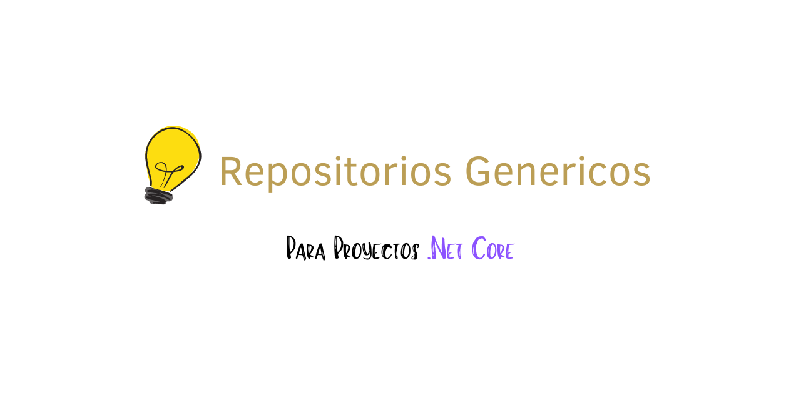

# Repositorio Generico .Net Core

Un repositorio generico no es más que la definicion de un repositorio donde existen operaciones basicas de busqueda, actualizacion, creacion y eliminacion de un modelo especificado por algun tipo generico definido en la clase.

## ¿Porque debe ser generico?

Existen muchos escenarios donde los repositorios son mas que copias de si mismo repitiendo muchas veces las operaciones, por eso se ha creado la idea de que se genere un solo repositorio donde este se pueda usar con todos los modelos existentes.

## ¿Ventajas de usar repositorios genericos?

Las ventajas de usar repositorios genericos son varias pero nombrare las mas importantes.

1. No repetir codigo.
2. Separar el contexto de la base de datos de la logica de negocio y sí se llegase a cambiar de base de datos esto no afecte a la logica de negocio.

## ¿Desventajas de usar repositorios genericos?

1. Si necesitas un repositorio con funciones mas especificas deberas implementar un repositorio diferente o deberas modificar el repositorio generico.

